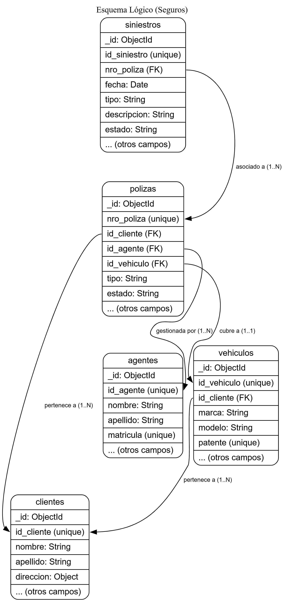
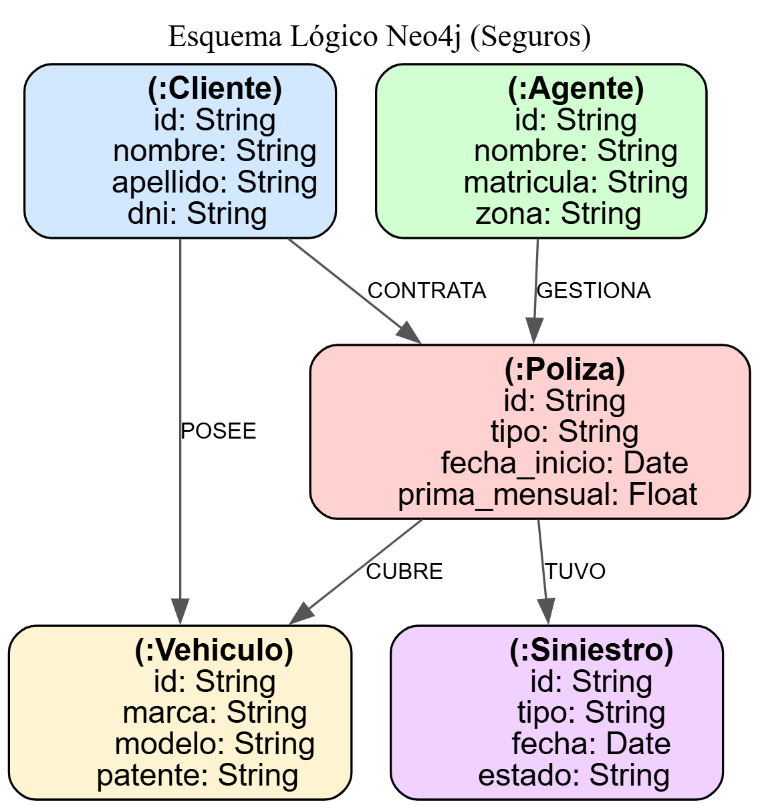

# Informe: Justificación de las bases de datos elegidas

## Resumen

Para el sistema de aseguradoras se eligió una arquitectura políglota usando:

- **MongoDB** como base de datos principal (sistema de almacenamiento y consulta de documentos).
- **Neo4j** como base de datos de grafo para proyecciones y consultas relacionales/analíticas.

Esta combinación responde a los requisitos funcionales y no funcionales del enunciado: facilidad para almacenar los registros proporcionados (clientes, pólizas, vehículos, siniestros), operaciones CRUD eficientes, y consultas relacionales complejas (por ejemplo, siniestros relacionados por póliza y sus agentes) donde los grafos aportan consultas más naturales y performantes.

## Requerimientos y motivación

**Requisitos funcionales relevantes**:

- Persistir las entidades relevantes: clientes, agentes, vehículos, pólizas, siniestros.
- CRUD consistente y rápido sobre la fuente de verdad.
- Consultas analíticas y relacionales: top clientes por cobertura, siniestros tipo Accidente en el último año, relaciones cliente–poliza–vehículo–siniestro, conteos por agente.
- Operaciones de carga por lotes (CSV), y endpoints REST para inserción y consulta.
- Proyección a un grafo para casos donde las relaciones y travesías son frecuentes.

**Requisitos no funcionales**:

- Desarrollo rápido y flexible (prototipo/TP).
- Escalabilidad vertical/horizontal razonable.
- Tolerancia a datos semi-estructurados (fechas en distintos formatos, flags, etc).
- Despliegue reproducible (Docker Compose).

## Por qué MongoDB (base primaria)

**Ventajas principales para este dominio**:

1. Modelo de documentos natural:
   - Los objetos (cliente, póliza, siniestro, vehículo) se mapearán directamente a documentos JSON/BSON.
   - Flexibilidad para evoluciones de esquema (p. ej. nuevos campos en pólizas) sin migraciones pesadas.
2. Buen soporte para carga de datos mediante CSV y transformaciones:
   - `mongoimport` y drivers permiten cargar datos rápidamente; la colección actúa como la fuente de la verdad.
3. Consultas y agregaciones potentes:
   - El framework de agregación permite pipelines para unir datos y producir vistas analíticas (utilizado en los endpoints).
4. Índices y rendimiento:
   - Índices compuestos (p. ej. `id_cliente + nro_poliza`) y únicos son fáciles de definir y protegen integridad en ciertos casos.
5. Ecosistema y rapidez de prototipado:
   - Integración nativa con Node.js (driver `mongodb`), amplia documentación.

**Compatibilidad con requisitos**:

- Las operaciones CRUD y búsquedas por campo (dni, nro_poliza, patente) son eficientes con índices.
- El modelo es tolerante a los datos presentados y errores menores en formatos (fechas), con conversión en la capa de la API.

**Limitaciones y mitigaciones**:

- Consultas relacionales complejas con múltiples hops (p. ej. “vecinos a distancia n”) son menos naturales/performantes que en un grafo. Se resuelve proyectando relaciones a Neo4j para esas consultas.
- Garantías ACID a nivel multi-colección no nativas: usar esquema con claves únicas y validaciones, o adoptar transacciones MongoDB (si necesario) para operaciones multi-documento críticas.

## Por qué Neo4j (grafo para proyección)

**Ventajas para este dominio**:

1. Consultas relacionales naturales y eficientes:
   - Búsquedas por patrones (clientes conectados por vehículos, agentes y siniestros) se expresan concisamente en Cypher y suelen ejecutarse muy rápido.
2. Analíticas de red:
   - Topologías, recorridos y filtrados por tipos de relación (p. ej. "siniestros Accidente en el último año") son sencillas.
3. Proyección eventual:
   - Mantener MongoDB como fuente de verdad y proyectar nodos/relaciones permite combinar lo mejor de ambos mundos: integridad y almacenamiento flexible (Mongo) + consultas de grafo rápidas (Neo4j).
4. Constraints y unicidad:
   - Los constraints definidos facilitan mantener identificadores únicos en el grafo (p. ej. id de poliza, id de cliente).

**Caso de uso exacto cubierto**:

- Endpoints que requieren travesías y conteos orientados a relaciones (ej. agente→poliza→siniestro) se resuelven con Cypher o proyecciones específicas.

**Limitaciones y mitigaciones**:

- Sincronización eventual: la proyección puede fallar; el diseño registra errores de sincronización (`_neo4j_sync_error`) y sigue operando desde Mongo.
- Coste operativo: mantener dos sistemas implica duplicar backups, monitoreo y procesos de ETL; se compensa por la mejora en velocidad/respuesta para consultas de grafo.

## Decisiones de modelado

**MongoDB (fuente de verdad)**

- Colecciones y campos (ejemplos):
  - `clientes`: { id_cliente, nombre, apellido, dni, contacto..., activo }
  - `polizas`: { nro_poliza, id_cliente, tipo, fecha_inicio, fecha_fin, prima_mensual, cobertura_total, id_agente, estado }
  - `vehiculos`: { id_vehiculo, id_cliente, marca, modelo, anio, patente, nro_chasis, asegurado }
  - `siniestros`: { id_siniestro, poliza_id (nro_poliza), fecha, tipo, monto_estimado, descripcion, estado }
  - `agentes`: { id_agente, nombre, apellido, matricula, activo, zona }

- Índices:
  - Polizas: { id_cliente }, { id_agente }, { estado }, { fecha_inicio }, { fecha_fin }, índice único compuesto para evitar duplicados lógicos: { id_cliente, nro_poliza }.
  - Vehiculos: índice único sobre `patente`.
  - Siniestros: índices por `poliza_id`, `tipo`, `fecha`.
  - Clientes: índice por `id_cliente` y por `dni` si se requiere búsqueda rápida.

Las colecciones y sus relaciones principales pueden observarse en el **esquema lógico de MongoDB** (ver Fig. 1), donde se muestra la estructura documental y las referencias entre entidades.  
Los campos clave, índices definidos e identificadores únicos se detallan en el **esquema físico de MongoDB** (ver Fig. 2), que complementa la definición de las colecciones.

- Normalización vs Denormalización:
  - Se optó por mantener referencias (`id_cliente` en polizas, `poliza_id` en siniestros) en lugar de duplicar datos en cascada. Esto mantiene la fuente de verdad en un sitio y evita inconsistencias.

**Neo4j (grafo proyectado)**

- Nodos: `Cliente`, `Poliza`, `Vehiculo`, `Agente`, `Siniestro`.
- Relaciones:
  - (Cliente)-[:POSEE]->(Vehiculo)
  - (Cliente)-[:CONTRATA]->(Poliza)
  - (Agente)-[:GESTIONA]->(Poliza)
  - (Poliza)-[:TUVO]->(Siniestro)

El modelo de grafo adoptado se resume en la **Fig. 3**, que muestra los nodos principales, los tipos de relación y las propiedades clave definidas mediante constraints en Neo4j.  
En este diseño se reflejan las asociaciones más relevantes del dominio (cliente–póliza–vehículo–siniestro–agente), optimizadas para consultas por patrones y recorridos.

- Identificadores:
  - Cada nodo tiene propiedad `id` con el id lógico (ej. `id_cliente`, `nro_poliza`, `id_siniestro`) y se definieron constraints de unicidad via `scripts/neo4j/init.cypher`.


## Esquemas de Datos

En las siguientes figuras se presentan los esquemas resultantes de las decisiones de modelado descritas anteriormente, distinguiendo entre el nivel lógico y el físico para cada base de datos.  
Estas representaciones permiten visualizar la correspondencia entre las entidades del dominio y su implementación en MongoDB y Neo4j.

### MongoDB — Esquema Lógico
<p align="center">
  
</p>
<p align="center"><em>Fig. 1 — Esquema lógico de colecciones y referencias</em></p>

### MongoDB — Esquema Físico
<p align="center">
  
</p>
<p align="center"><em>Fig. 2 — Campos clave e índices/“FKs” lógicas</em></p>

### Neo4j — Esquema Lógico/Físico
<p align="center">
  
</p>
<p align="center"><em>Fig. 3 — Nodos, propiedades y relaciones con constraints</em></p>


## Estrategia ETL / sincronización

El proceso de sincronización se basa en los modelos representados en las Fig. 1 a 3, donde se ilustra la estructura de datos de origen (MongoDB) y su proyección equivalente en Neo4j.  
De esta forma, el flujo ETL mantiene coherencia directa entre el modelo documental y el modelo de grafo.

- Flujo: los datos se escriben en Mongo (fuente principal). Un job ETL (por lotes o por inserción) proyecta/actualiza nodos y relaciones en Neo4j.
- Dual-write para operaciones en tiempo real: la API primero escribe en Mongo y luego intenta proyectar a Neo4j; en caso de error se marca el documento con un campo de error para reconciliación posterior.
- Lotes: el job `src/jobs/etl_mongo_to_neo4j.js` lee en lotes y ejecuta transacciones en Neo4j para crear/mergear nodos/relaciones de forma eficiente.
- Consistencia: se asume consistencia eventual entre Mongo y Neo4j. Para necesidades de consistencia estricta (p. ej. operación que requiere ambas escrituras atómicas), se recomiendan mecanismos transaccionales o un coordinador de compensaciones (saga pattern).

## Índices, rendimiento y escalabilidad

En MongoDB, se definieron índices sobre los campos más utilizados en filtros y ordenamientos —como fecha_inicio, fecha_fin y estado— para evitar recorridos completos de las colecciones y mejorar el rendimiento de las consultas.
Además, se usan índices compuestos en los casos donde las búsquedas combinan varios criterios (por ejemplo, cliente y número de póliza).
Respecto a la escalabilidad, MongoDB puede crecer tanto vertical como horizontalmente: mediante réplicas para mejorar la disponibilidad o sharding si el volumen de datos o tráfico aumenta. Para el contexto del trabajo práctico, la configuración actual es más que suficiente.

En Neo4j, se aplicaron constraints e índices sobre las propiedades clave (como identificadores de nodos) para acelerar las búsquedas y garantizar unicidad.
En sistemas con grafos muy grandes o relaciones muy densas, se recomienda escalar verticalmente (más CPU y memoria). Nuevamente, la configuración actual para el trabajo realizado se considera suficiente.

## Alternativas consideradas

1. **HBase**:
   - Desventajas
      - Complejidad operacional innecesaria: HBase requiere un cluster Hadoop completo (HDFS, ZooKeeper, RegionServers), lo cual es excesivo para el volumen de datos a trabajar.
      - Modelo de datos inadecuado: HBase es column-family oriented, diseñado para casos con millones de filas y pocas columnas. Los datos de aseguradoras (clientes, pólizas, siniestros) son más naturalmente documentales con estructuras complejas anidadas.
      - Consultas limitadas: Solo permite queries por row key, sin soporte nativo para consultas secundarias complejas como "siniestros tipo Accidente en el último año por agente" sin implementar índices externos.
      - Overhead vs beneficio: Diseñado para Big Data (petabytes), pero el dominio de aseguradoras maneja volúmenes moderados donde la flexibilidad es más valiosa que la escalabilidad extrema.
   - Ventajas
      - No se encontró ningún motivo que amerite el uso de HBase por sobre MongoDB o Cassandra para alta escritura.
2. **Cassandra**:
   - Desventajas
      - Modelado data-driven inflexible: Cassandra requiere modelar las tablas según las queries específicas (query-first design). Los requisitos del TP incluyen múltiples tipos de consultas analíticas que cambiarían el modelo constantemente.
      - Joins inexistentes: No soporta joins nativos, y las relaciones cliente→póliza→vehículo→siniestro requerirían múltiples roundtrips o denormalización excesiva.
      - Agregaciones limitadas: Las consultas analíticas requeridas (conteos por agente, top clientes por cobertura) son complejas de implementar sin un framework de agregación robusto como el de MongoDB.
      - Eventual consistency por defecto: Para datos financieros/legales como pólizas y siniestros, la consistencia eventual puede ser problemática sin configuración adicional compleja.
   - Ventajas
      - Write throughput masivo sin degradación, replicación multi-datacenter para compliance de respaldo geográfico. Esto ayudaría para auditorías y logging de varias transacciones.
      - Escalabilidad lineal para picos de carga (ej. notificaciones masivas post-catástrofe natural). Si se quisieran agregar notificaciones en tiempo real.
3. **Redis**
   - Desventajas
      - Limitaciones de persistencia: Aunque Redis tiene persistencia, está optimizado como cache/store en memoria. Para datos críticos de aseguradoras se necesita durabilidad garantizada sin riesgo de pérdida.
      - Estructura de datos simplista: Redis maneja estructuras clave-valor, sets, hashes, pero no documentos complejos. Los objetos de aseguradoras (pólizas con coberturas, siniestros con detalles) se benefician del modelo documental.
      - Consultas ad-hoc imposibles: No tiene lenguaje de query para búsquedas complejas. Todo debe ser pre-indexado por clave, lo cual no se adapta a los requisitos analíticos del dominio.
      - Escalabilidad vertical: Redis Cluster es más complejo de administrar que las opciones nativas de sharding de MongoDB.
   - Ventajas
      - Latencia ultra-baja crítica para UX de cotización online, atomic operations para contadores de usage/límites. Para cachear sesiones en caso de querer armar una app o calcular primas en vivo.
      - Procesamiento in-memory permite decisiones instantáneas de aprobación/rechazo de siniestros. Para prevenir fraude en lugar de tener que realizar auditoría caso por caso.

### Conclusión
Si bien las alternativas pueden aportar ventajas, estas se presentan en casos MUY específicos que no sucederán en el contexto de este trabajo ni tiene sentido considerar dado que estos exceden la funcionalidad pedida del sistema. Es por esto que se definió el uso de MongoDB + Neo4j

## Trade-offs y riesgos

- Complejidad operativa mayor (dos DBs) frente a beneficio en rendimiento y modelado.
- Consistencia eventual entre Mongo y Neo4j implica diseñar correctamente la reconciliación y advertir sobre ventanas donde Neo4j y Mongo divergen.
- Para workloads con alto volumen de relaciones dinámicas, mantener la proyección en tiempo real (dual-write) puede exigir robustecer la infraestructura.

## Comandos `curl` y Resultados

A continuación se muestran los comandos `curl` que permiten verificar el cumplimiento de todos los servicios y consultas requeridos en el Trabajo Práctico.  
Cada comando puede ejecutarse directamente sobre la API desplegada en `http://localhost:3000`, utilizando `jq` para formatear la salida JSON.

---

### **1. Clientes activos con pólizas vigentes**

```bash
curl -s "http://localhost:3000/clientes/activos-con-polizas" | jq
```

**Resultado:**
```json
{
  "page": 1,
  "pageSize": 25,
  "total": 35,
  "items": [
    {
      "id_cliente": 10,
      "nombre": "Anastasia",
      "apellido": "Vives",
      "polizas_vigentes": [
        {
          "_id": "691512b716d7a40aa144b30b",
          "nro_poliza": "POL1010",
          "tipo": "Auto",
          "estado": "ACTIVA",
          "fecha_inicio": "2024-11-21",
          "fecha_fin": "2025-11-21"
        }
      ]
    },
    ...
  ]
}
```

---

### **2. Siniestros abiertos (o cerrados entre fechas)**

```bash
curl -s "http://localhost:3000/siniestros/abiertos" | jq
```

**Resultado:**
```json
[
  {
    "cliente_id": "5",
    "poliza_id": "POL1005",
    "siniestro_id": "691512b704b4a40473b78f86",
    "tipo": "Danio",
    "monto": 151500,
    "fecha": "2025-05-17"
  },
  ...
]
```

```bash
curl -s "http://localhost:3000/siniestros/abiertos?estado=<ESTADO>&desde=<YYYY-MM-DD>&hasta=<YYYY-MM-DD>" | jq
```

**Resultado:**
```json
[
   {
    "cliente_id": "4",
    "poliza_id": "POL1004",
    "siniestro_id": "691512b704b4a40473b78f85",
    "tipo": "Robo",
    "monto": 301500,
    "fecha": "2024-08-25"
  },
  ...
]
```
---

### **3. Alta de cliente**

```bash
curl -s -X POST http://localhost:3000/clientes \
  -H "Content-Type: application/json" \
  -d '{"id_cliente":<ID>,"nombre":"<Nombre>","apellido":"<Apellido>","email":"<Email>"}' | jq
```

**Resultado:**
```json
{
  "_id": "6915159084d56aea3c4a5177",
  "id_cliente": 9999,
  "nombre": "Ana",
  "apellido": "Test",
  "dni": null,
  "email": "ana@test.com",
  "telefono": null,
  "direccion": null,
  "ciudad": null,
  "provincia": null,
  "activo": true
}
```

---

### **4. Alta de siniestro**

```bash
curl -s -X POST http://localhost:3000/siniestros \
  -H "Content-Type: application/json" \
  -d '{"nro_poliza":"<NRO_POLIZA>","tipo":"<Tipo>","descripcion":"<Texto>","monto_estimado":<Monto>}' | jq
```

**Resultado:**
```json
{
  "_id": "691515b284d56aea3c4a5178",
  "id_siniestro": 9081,
  "nro_poliza": "POL1001",
  "fecha": "2025-11-12",
  "tipo": "Robo",
  "monto_estimado": 123456,
  "descripcion": "Robo de auto",
  "estado": "Abierto"
}
```

---

### **5. Dar de baja cliente**

```bash
curl -s -X PATCH http://localhost:3000/clientes/<ID_CLIENTE>/baja | jq
```

**Resultado:**
```json
{
  "ok": true
}
```

---

### **6. Modificar datos parciales de cliente**

```bash
curl -s -X PATCH "http://localhost:3000/clientes/<ID_CLIENTE>" \
  -H "Content-Type: application/json" \
  -d '{
    "nombre": "<NOMBRE>", "apellido": "<APELLIDO>","dni": "<DNI>",
    "email": "<EMAIL>","telefono": "<TELEFONO>", "direccion": "<DIRECCION>",
    "ciudad": "<CIUDAD>","provincia": "<PROVINCIA>"
  }' | jq
```

**Resultado:**
```json
{
  "id_cliente": 99999,
  "nombre": "Ana",
  "apellido": "Test",
  "dni": null,
  "email": "ana@test.com",
  "telefono": "01223334444",
  "direccion": "Direccion cambiada",
  "ciudad": null,
  "provincia": null,
  "activo": true
}
```

---

### **7. Consultas avanzadas (MongoDB)**

**Vehículos asegurados**
```bash
curl -s "http://localhost:3000/vehiculos/asegurados" | jq
```

**Resultado:**
```json
[
   {
      "patente":"VP752BU",
      "marca":"Volkswagen",
      "modelo":"Gol",
      "cliente":
      {
         "id":149,
         "nombre":"Sandra",
         "apellido":"Gilabert"
      },
      "polizas":
      [
         {
            "nro_poliza":"POL1149",
            "tipo":"Auto",
            "fecha_inicio":"2025-03-02",
            "fecha_fin":"2026-03-02"
         }
      ]
   },
   ...
]
```

**Clientes sin pólizas activas**
```bash
curl -s "http://localhost:3000/clientes/sin-polizas-activas" | jq
```

**Resultado:**
```json
[
   {
      "id_cliente":18,
      "nombre":"Ricardo",
      "apellido":"Barral"
   },
   ...
]
```

**Agentes activos con cantidad de pólizas**
```bash
curl -s "http://localhost:3000/agentes/activos-con-cant-polizas" | jq
```

**Resultado:**
```json
[
   {
      "id_agente":102,
      "nombre":"María",
      "cant_polizas":44
   },
   ...
]
```

**Pólizas vencidas con cliente**
```bash
curl -s "http://localhost:3000/polizas/vencidas-con-cliente" | jq
```

**Resultado:**
```json
[
   {
      "nro_poliza":"POL1124",
      "tipo":"Auto",
      "fecha_fin":"2026-02-25",
      "cliente":{
         "id":124,
         "nombre":"Darío",
         "apellido":"Villena"
         }
   },
   ...
]
```

**Clientes top por cobertura**
```bash
curl -s "http://localhost:3000/clientes/top-cobertura" | jq
```

**Resultado:**
```json
[
   {
   "id_cliente":54,
   "nombre":"Ainara",
   "apellido":"Santana",
   "cobertura_total":2500000
   },  
   ...
]
```

---

### **8. Consultas avanzadas (Neo4j)**

**Siniestros tipo "Accidente" del último año**
```bash
curl -s "http://localhost:3000/siniestros/accidente-ultimo-anio" | jq
```

**Resultado:**
```json
[
   {
      "cliente_id":"2",
      "poliza_id":"POL1002",
      "siniestro_id":"691512b704b4a40473b78f84",
      "fecha":"2025-04-04"
   },
   ...
]
```

**Pólizas activas ordenadas**
```bash
curl -s "http://localhost:3000/polizas/activas-ordenadas" | jq
```

**Resultado:**
```json
[
   {
   "page":1,
   "pageSize":25,
   "total":52,
   "items":
      [
         {
            "nro_poliza":"POL1010",
            "tipo":"Auto",
            "fecha_inicio":"2024-11-21",
            "fecha_fin":"2025-11-21",
            "estado":"ACTIVA"
         },
         ...
      ]  
   }
]
```

**Pólizas suspendidas con estado de cliente**
```bash
curl -s "http://localhost:3000/polizas/suspendidas-con-estado-cliente" | jq
```

**Resultado:**
```json
[
   {
      "nro_poliza":"POL1013",
      "tipo":"Auto",
      "estado":"SUSPENDIDA",
      "cliente":{
         "id":13,
         "nombre":"Cándida",
         "apellido":"Adán",
         "activo": true
         }
   },
   ...
]
```

**Clientes con múltiples vehículos**
```bash
curl -s "http://localhost:3000/clientes/con-multiples-vehiculos" | jq
```

**Resultado:**
```json
[
   {
    "id_cliente": <ID>,
    "nombre": <NOMBRE>,
    "apellido": <APELLIDO>,
    "cant_vehiculos": <CANTIDAD>
  }
]
```

**Agentes con cantidad de siniestros**
```bash
curl -s "http://localhost:3000/agentes/cant-siniestros" | jq
```

**Resultado:**
```json
[
   {
      "id_agente":"102",
      "cant_siniestros":{
         "low":22,
         "high":0
      }
   },
   ...
]
```

---

### **9. Emisión de nueva póliza (validando cliente y agente)**

```bash
curl -s -X POST http://localhost:3000/polizas \
  -H "Content-Type: application/json" \
  -d '{"nro_poliza":<POLIZA>,"id_cliente":<ID>,"id_agente":<ID>,"tipo":"<Tipo>","fecha_inicio":"<YYYY-MM-DD>","fecha_fin":"<YYYY-MM-DD>"}' | jq
```

**Resultado:**
```json
{
  "nro_poliza": "POL3001",
  "id_cliente": 99999,
  "id_agente": 102,
  "tipo": "Auto",
  "fecha_inicio": "2025-01-15",
  "fecha_fin": "2026-01-15",
  "prima_mensual": null,
  "cobertura_total": null,
  "estado": "ACTIVA",
  "_id": "69151c04db58aabffe1977f9"
}
```

